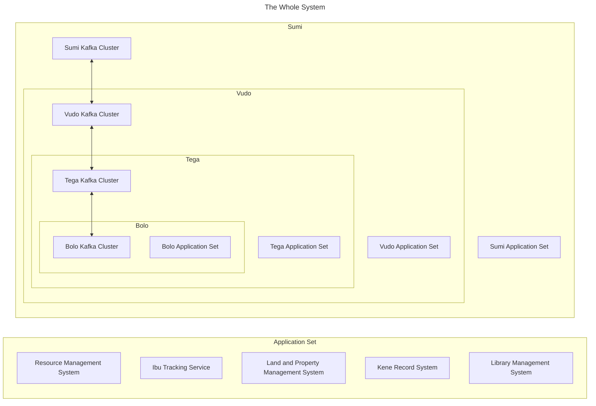

# BoloBolo
This is a compilation of all the software required for bolo-bolo. It is meant to be extensible and adaptable to all Bolos. It's suggested to be familiar with bolo-bolo and its workings to work with this documentation. 

The overall goal of this project is to create documentation around a software system and data structures that can be used to monitor and request the necessary resources for each individual bolo and their higher collectives. This is the digital Sila. The Kene is purely for communication itself, these systems are what allow bring about Fasi and enable Mali.

## Highest Level Architecture 
The smallest unit of this system is the Bolo, comprised of its four systems which monitor resources, people, housing, and contracts between the bolos. These systems are meant to ensure that everything can be properly allocated where it needs to go when it's needed. 

Each layer duplicates the previous layers data and acts as a backup and coordination system. When resources are needed, requests can be bubbled up through each level. When these requests are able to be fullfilled a response
is propogated back down the change over kafka messaging. This event driven system allows many or few Bolos to cooperate together and communicate.  

Each individual application required for this system will have its own project folder in this repo. As Each is fleshed out more of this top layer README will also get filled out. All changes will require readme updates. 
