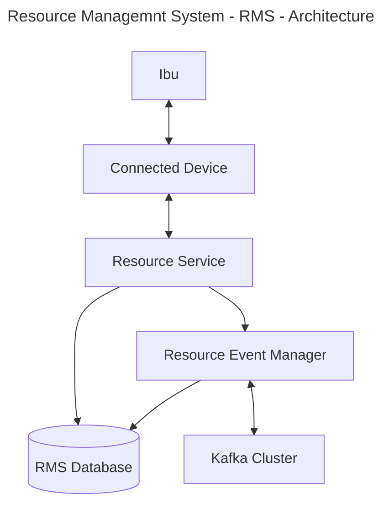
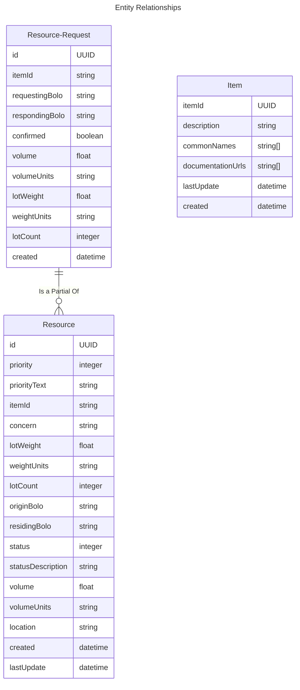

# Resource Management System - RMS

This is a key system used to manage consumable resources across Bolos and within the Bolo. This system is for registering the creation and consumption of resources as well as helping them to be
tracked, shared, and stored in a logical fashion. This system is crucial and fundamental to feeding people and ensuring the bottom rungs of their needs are met.



### The Resources to Manage

The resources to manage have to be scaled properly from one to five, one being the most important. These will have string monikers attached to them in order to easily convey meaning. These records are created, managed, and edited at the bolo level. Each and every single one is unique and corresponds to a lot or grouping of that item. If something about a lot was entered incorrectly, it should be removed and replaced with a new lot featuring the correction. Each lot has a unique ID which is a UUID. These are impossible to replicate, making them great for large systems requiring unique records be kept.

JSON will be used as the format sending and representing all records in this system. It's well known and well established.

```json
{
  "id": "UUID",
  "priority": 1,
  "priorityText": "priority description text",
  "itemId": "Unique Id for that particular type of item",
  "concern": "sila, pali, kodu, bete",
  "lotWeight": 20.03,
  "weightUnits": "kg/lb/oz",
  "lotCount": 0,
  "originBolo": "Unique id of the bolo the resource originates from",
  "residingBolo": "Unique id of the bolo where the resource currently is",
  "status": 1,
  "statusDescription": "A breif description of what the status number means",
  "volume": 200.32,
  "volumeUnits": "cm/m/ft cubed unit",
  "location": "A nullable string that can be anything to denote location when in a stored status.",
  "created": "a string date time",
  "lastUpdate": "a stringy date time"
}
```
The status indicates whether not an item can be transferred between Bolos. Status and priority descriptions come from the bolo where the items originate, but the numbers have consistent meanings that have to be abided by.

The purpose of the priority is to allow communities to quickly rate requests from other Bolos and manage local resources. If a request from another Bolo comes in for anything of a one or two priority level, there should be a scramble to resonably fill that request. Priority 3 and below will always be put on the back burner though.
This is also reflected in the pace at which requests are escalated. If a Bolo finds that it will be short on a resource and requests assistance from the other communities, a priority one will be escalated to a wider area long before a priority five would be.

#### Priority
1. These are top priority items like food and water that are required for people to live. These items are also generally perishable. Some medical supplies may fall into this category.
2. This is medical supplies with a long shelf life as well as any other items that are critical to the health of the people living any Bolo.
3. Raw materials used to create goods at any tier. Raw materials are more important to the independence of each Bolo than finished products.
4. Items that are critical purely from an ease of living and quality of life. For example, if you don't have a new battery for your phone, it could be a pain to charge it, but you won't encounter bodily harm without it for example.
5. Toys and other purely consumer goods that serve no purpose other than entertainment or unwarranted convenience.

#### Status
- The status is used to mark records as consumed, stored, up for distribution, and other things.
- These have to be consistent across all bolos similar to priority.
- Status mappings, similar to priority mappings are stored in the system's database.

### Item Data

```json
{
  "itemId": "ITEM001",
  "description": "High-quality industrial drill used for precision engineering.",
  "commonNames": [
    "Precision Drill",
    "Industrial Drill",
    "Engineering Drill"
  ],
  "documentationUrls": [
    "https://example.com/docs/industrial-drill-manual.pdf",
    "https://example.com/tutorials/using-the-precision-drill",
    "https://example.com/specs/industrial-drill-specifications"
  ],
  "lastUpdate": "string datetime",
  "created": "string datetime"
}
```
This data structure is fairly self explainatory, but it's important to note that it's documentation sources are created by those that create  the new item. 
The commonNames field exists to be searched for so that new items aren't created that duplicate others. This system is kept up to date by reading kafka stream 
records that are sent down. These can also be added and updated from any bolo. These are living documents that can be added and updated easily. Deletion is not 
normally done though.

### Product Requirements
1. Allows only members of the bolo to add, remove, and update resources.
2. Only Item statuses are allowed to be updated.
3. When something is broken into smaller units, the original record is marked as consumed and new item records are created.
4. Everything is written as functional code with no program state.
5. All state resides in the database.
6. All updates result in the new version of the record being returned to the updating system. Whether the request comes through a stream or api interface. 

### Technology Requirements
1. Java 17
2. Scala 3.3
3. Pekko

### Database Setup Steps
1. Setup Raspberry Pi headless installation
2. Login to the raspberry pi using an SSH connection
3. Setup MySql Maria DB that will be used to write records to with following commands
```shell
sudo apt update
sudo apt upgrade
sudo apt install mariadb-server
sudo mysql_secure_installation 
sudo mysql -u root -p
CREATE DATABASE exampledb;
CREATE USER 'exampleuser'@'%' IDENTIFIED BY 'pimylifeup';
GRANT ALL PRIVILEGES ON exampledb.* TO 'exampleuser'@'%';
```