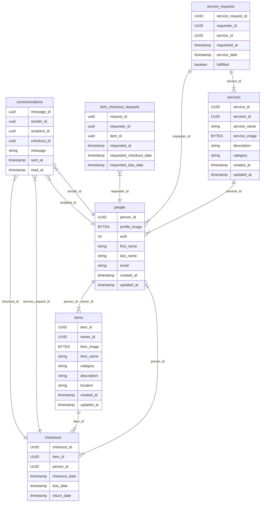
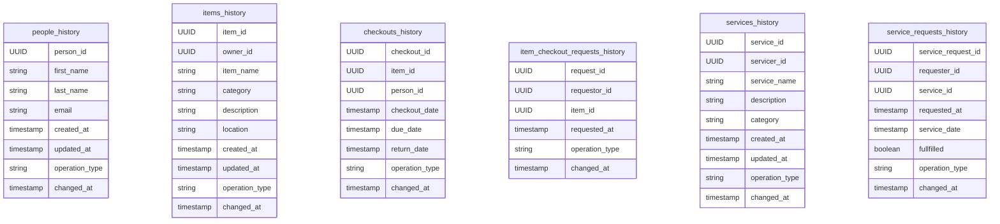
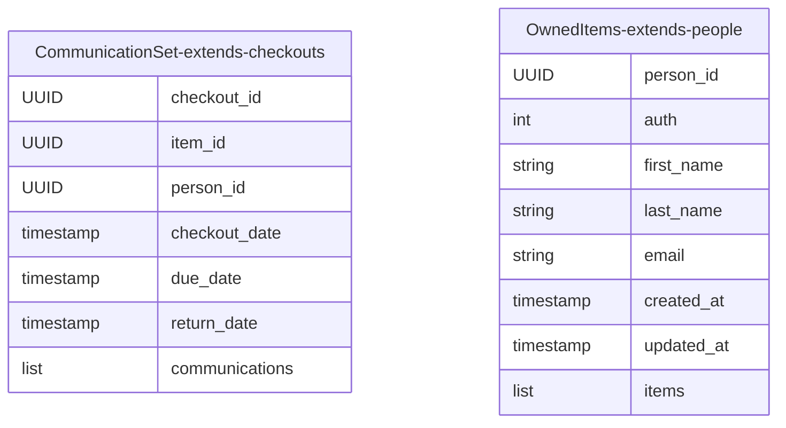
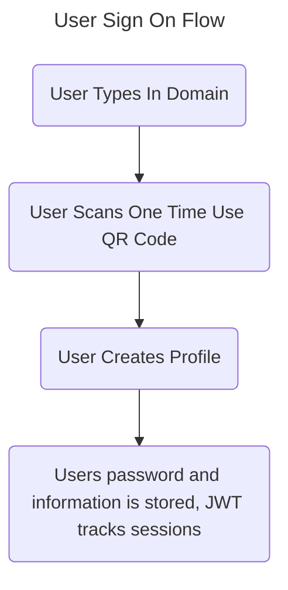
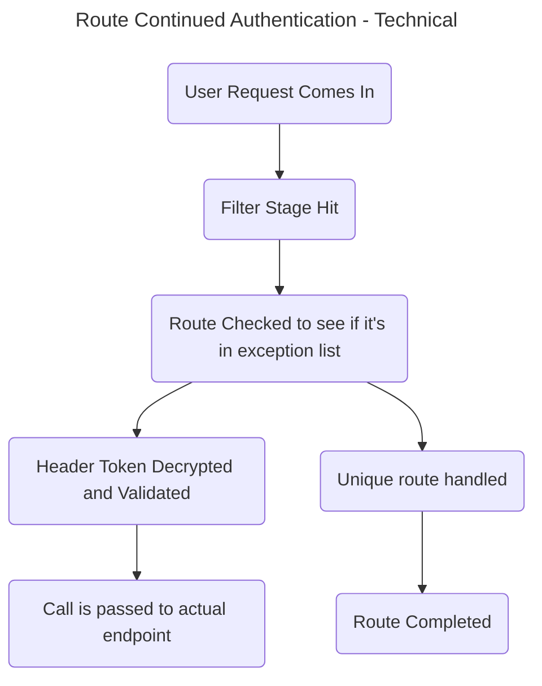

# Library-Keeper

This is a project dedicated to running a library of things. This suite contains everything required to keep track of items and check them out. 

Once complete it'll require just a compile and deployment of a single executable.

## Data Entities

A comprehensive description and documentation of all data entities in the system

### Database Entities
Check database and table creation script for field restrictions.

### Historical Database Entities
These are auditing tables. They're meant only to be used to gauge usage and activity and verify that what someone says happened happened. 

### Application Entities
These are entities that exist purely in the application and on the front end of the application. All of them act as extensions
or compilations of the database entities to make them usable to the frontend. 

## User Interaction Flows 

These are descriptions of the basic flows within that application to facilitate the checking in and out of items and requests for services

